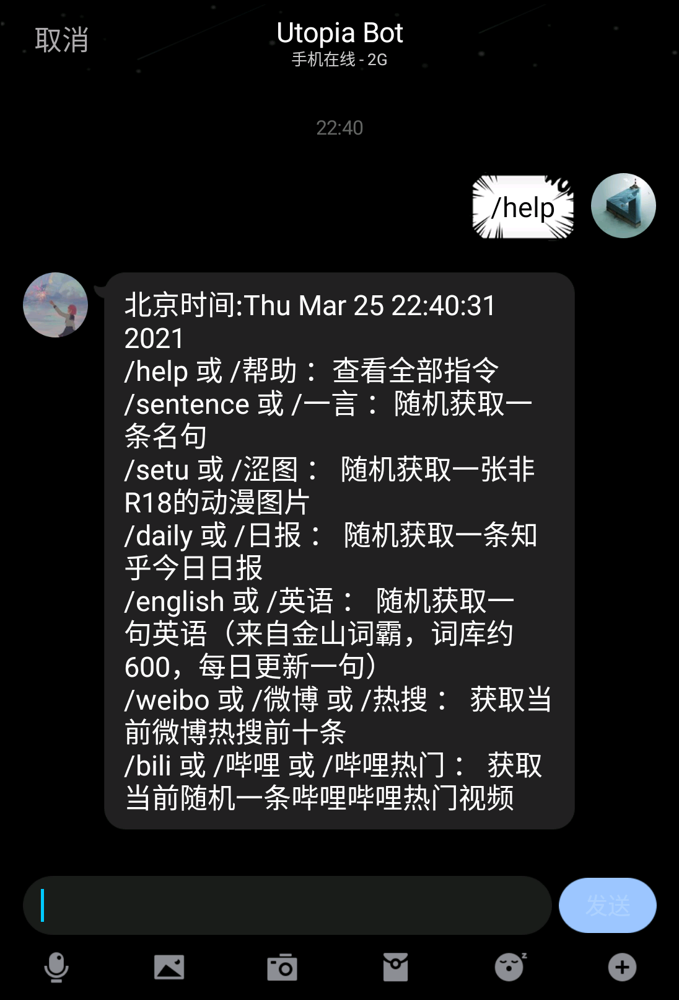

# Utopia-Bot-For-QQ

[](https://github.com/UtopiaXC/Utopia-Bot-For-QQ/blob/master/LICENSE)
[](https://www.python.org/downloads/)  
这是一个基于[nonebot](https://github.com/nonebot/nonebot)机器人框架与[go-cqhttp](https://github.com/Mrs4s/go-cqhttp)客户端设计的QQ聊天机器人  
文档更新时间 2021-03-26 08:15

## 目录

1. [简介](#简介)
2. [接口使用](#接口使用)
3. [部署](#部署)
4. [功能](#功能)
5. [注意](#注意)
6. [开源许可与免责声明](#开源许可与免责声明)

## 简介

本项目完全由Python实现。依托于开源QQ机器人nonebot提供机器人服务对消息进行解析及相应，通过go-cqhttp客户端登录QQ并进行消息接收与发送。  
本项目代码难度是非常非常非常低的  
目前仅实现了少数计划功能  
Telegram版本的Utopia Bot正在开发中  
部署前请对API进行调试  
功能计划：

- [x] 查看全部指令
- [x] 一言
- [x] 涩图自动机
- [x] 知乎日报
- [x] 英语句子（词霸来源）
- [x] 微博热搜
- [x] 哔哩哔哩热门视频
- [x] 天气查询
- [ ] 大盘行情与自选股
- [ ] 每日考研英语（何凯文来源）
- [ ] NLP聊天机器人
- [ ] 复读机
- [ ] 违禁语言检测
- [ ] 自动加群审批
- [ ] 自动成员清理
- [ ] 聊天图片鉴黄
- [ ] ~~签到自动机~~
- [ ] ~~运气游戏~~
- [ ] ~~大富翁~~
- [ ] 等等等等还在考虑

## 接口使用

1. 句子接口：[一言·Hitokoto](https://hitokoto.cn/)  
   本接口使用方法请查阅官方文档，这里不再赘述
2. 涩图接口：[Lolicon API](https://api.lolicon.app/#/setu)  
   使用本接口时请注意：  
   使用前请使用接口官网的提供的Telegram机器人申请apikey，请求的时候需要带上此参数。  
   本接口返回的是Pixiv图片链接而不是图片原图，所以当你发现该机器人在部署好之后无法发送图片请保证运行该机器人的服务器能正常访问Pixiv。  
   此外，本接口存在R18内容，请自行过滤并带上相关参数。
3. 知乎日报：[知乎官方API](https://news-at.zhihu.com/api/3/stories/latest)  
   本接口为知乎日报的官方API，每次返回全部日报信息，本机器人每次发送仅选择一个发送。
4. 英语句子：[金山词霸每日英语](http://sentence.iciba.com/index.php?c=dailysentence&m=getdetail&title=2020-01-01)  
   本接口为金山词霸每日英语接口，每次返回一句英语，请注意title参数，该参数为获取句子的日期。机器人默认选取当天至当天前六百天内的任意一天进行爬取
5. 微博热搜：暂时由爬虫实现  
   一个无害的小型的网页爬虫，仅获取热搜前十，如需更多请自行修改循环次数。
6. 哔哩哔哩热门视频：[哔哩哔哩官方接口](https://api.bilibili.com/x/web-interface/popular?ps=1&pn=1)  
   哔哩哔哩的官方热榜接口。此处需要注意的是ps为每次获取的视频信息个数，pn为起始视频的实时热榜排名。因此在机器人中pn为1~50随机生成的来保证每次都能取到前50内不同的视频
7. 天气接口：[wttr.in](https://wttr.in/)  
    参考[luciabot](https://github.com/Box-s-ville/luciabot)的天气实现
## 部署

本块内容请参考[luciabot](https://github.com/Box-s-ville/luciabot)的文档

- ### 部署 go-cqhttp
    1. 请先参考官方部署教程
    2. 简单的部署讲解：  
       a. 在go-cqhttp仓库的release中下载对应平台的的客户端，例如X64架构CPU下Windows下载windows-amd64.exe版本，X64架构CPU下Linux下载linux-amd64版本等  
       b. 下载客户端后，请运行客户端，即命令行./go-cqhttp  
       c. 运行后关闭客户端，对配置文件config.hjson进行修改，修改方式在其中已经有所注释，一般只需要修改QQ号和QQ密码即可，然后重新启动客户端程序  
       d. 然后按照指示验证QQ登录，具体请参照go-cqhttp文档
- ### 部署Python环境
    1. 项目需要Python3，请保证您的服务器Python版本正确
    2. 需要安装库：nonebot（本体，必需）、requests（用于爬虫请求，必需）、beautifulsoup4（用于爬虫页面分析，微博模块必需）、jieba（用于分词，天气模块语义分析必需）、APScheduler（用于启动后台任务，涩图模块必需）、ujson（工具，可选）、msgpack（工具，可选）  
        ```pip install nonebot requests beautifulsoup4 jieba APScheduler ujson msgpack``` 
- ### 部署 Utopia Bot
    1. 选择一个合适的文件夹来准备放置项目文件
    2. 使用Git命令将项目克隆到本地，即  
       ```git clone https://github.com/UtopiaXC/Utopia-Bot-For-QQ.git```
    3. 进入文件夹，即  
       ```cd Utopia-Bot-For-QQ```
    4. 启动nonebot服务，即  
       ```python3 bot.py ```
- 注意：go-cqhttp与nonebot均需要常驻运行，请使用守护进程或screen

## 功能

1. ### 帮助
   
2. ### 一言
   
3. ### 涩图
   
4. ### 日报
   
5. ### 英语句子
   
6. ### 微博热搜
   
7. ### 哔哩哔哩热门视频
   
8. ### 天气
   

## 注意

1. 请注意，涩图接口存在R18内容，请带有r18=0参数访问接口
2. QQ机器人违反QQ使用条款，请使用新账号或小号进行部署，账号被封禁概不负责
3. 如果对go-cqhttp部署有疑问，请到原作者Git提Issue
4. 如果功能中截图无法查看，请使用全局代理后查看

## 开源许可与免责声明

本项目源码均采用MIT开源许可。源码设计仅作学习用途，严禁用于商业用途与其他违法用途。一切后果由使用者承担。